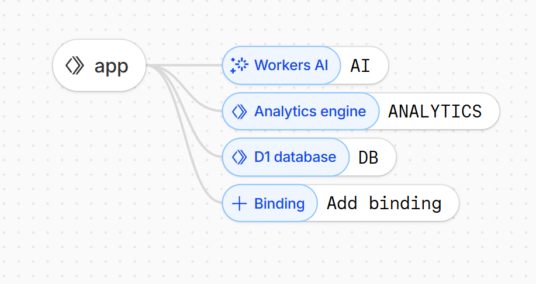

# Feedback Radar

A Cloudflare Workers application that analyzes customer feedback using AI to extract sentiment, urgency, tags, and summaries. Built with D1, Workers AI, and Analytics Engine.

## Overview

Feedback Radar allows you to:
- **Submit feedback** via a simple web interface or API
- **Automatically analyze** feedback using Workers AI (sentiment, urgency, tags, summary)
- **Store and query** feedback in D1 database
- **View insights** in a real-time dashboard with statistics and trends
- **Track metrics** via Analytics Engine for ingestion volume, AI latency, and errors

## Architecture

### Cloudflare Products Used

- **Workers** - Hosts the entire application (UI + API)
- **D1** - Persistent storage for feedback data and analysis results
- **Workers AI** - Analyzes feedback text to extract sentiment, urgency, tags, and summaries
- **Analytics Engine** - Tracks ingestion volume, AI latency, error rates, and dashboard views

### Data Flow

```
User submits feedback (UI/API)
    ↓
Store in D1 (pending status)
    ↓
Call Workers AI for analysis
    ↓
Update D1 with analysis results
    ↓
Emit Analytics Engine events
    ↓
Dashboard displays results
```

### Workers Bindings



The Worker uses three bindings:
- `DB` - D1 database connection
- `AI` - Workers AI for text analysis
- `ANALYTICS` - Analytics Engine dataset for metrics